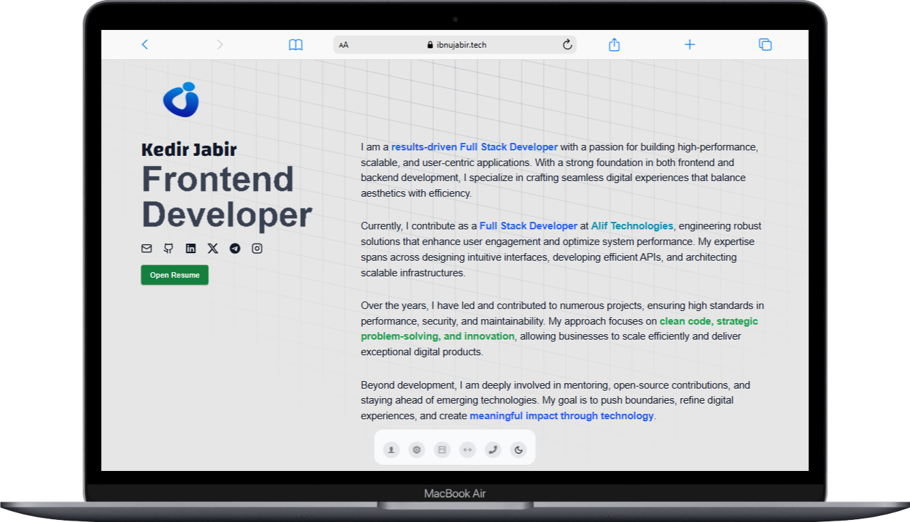

# Portfolio_v1

Welcome to my personal portfolio website repository! This project showcases my work, skills, and accomplishments as an IT developer.

## Screenshots





## Table of Contents

- [About](#about)
- [Features](#features)
- [Tech Stack](#tech-stack)
- [Getting Started](#getting-started)
  - [Prerequisites](#prerequisites)
  - [Installation](#installation)
  - [Running the Project](#running-the-project)
- [Usage](#usage)
- [Contributing](#contributing)
- [License](#license)
- [Acknowledgements](#acknowledgements)
- [Contact](#contact)

## About

This is the first version of my personal portfolio website, developed to provide an overview of my projects and skills. The live version is available at [ibnujabir.tech](https://ibnujabir.tech/).

## Features

- **Responsive Design**: Optimized for various devices and screen sizes.
- **Project Showcase**: Displays a selection of my notable projects with descriptions and links.
- **Skills Overview**: Highlights my technical competencies.
- **Experience Section**: Provides an overview of my professional background and experience.
- **About Section**: A detailed introduction about myself, my journey, and my aspirations.
- **Contact Form**: Allows visitors to get in touch with me directly.

## Tech Stack

- **Framework**: [Next.js](https://nextjs.org/)
- **Styling**: [Tailwind CSS](https://tailwindcss.com/)
- **Language**: [TypeScript](https://www.typescriptlang.org/)

## Getting Started

To get a local copy up and running, follow these steps.

### Prerequisites

Ensure you have the following installed:

- [Node.js](https://nodejs.org/en/download/) (which includes npm)
- [pnpm](https://pnpm.io/installation) (preferred package manager)

### Installation

1. **Fork the Repository**: Click the 'Fork' button at the top right of this page to create your own copy of the repository.

2. **Clone Your Fork**: Replace `your-username` with your GitHub username.

   ```bash
   git clone https://github.com/your-username/Portfolio_v1.git
   cd Portfolio_v1
   ```

3. **Install Dependencies**:

   ```bash
   pnpm install
   ```

### Running the Project

To start the development server:

```bash
pnpm dev
```

Open your browser and navigate to `http://localhost:3000` to view the website.

## Usage

Feel free to explore and modify the project to suit your needs. The main sections of the website include:

- **Home**: Introduction and brief overview.
- **About**: A detailed section about me, my journey, and aspirations.
- **Experience**: My work experience and professional background.
- **Projects**: Detailed descriptions of selected projects.
- **Skills**: A list of technical skills and proficiencies.
- **Contact**: A section to reach out to me directly.

## Contributing

Contributions are welcome! If you have suggestions or improvements, please follow these steps:

1. **Fork the Repository**: Create your own copy by clicking the 'Fork' button.

2. **Create a New Branch**: Name it descriptively, e.g., `feature/add-new-project`.

   ```bash
   git checkout -b feature/add-new-project
   ```

3. **Make Your Changes**: Implement your enhancements or fixes.

4. **Commit Your Changes**: Write clear and concise commit messages.

   ```bash
   git commit -m 'Add new project to portfolio'
   ```

5. **Push to Your Fork**:

   ```bash
   git push origin feature/add-new-project
   ```

6. **Open a Pull Request**: Navigate to the original repository and open a pull request with a detailed description of your changes.

## License

This project is licensed under the [MIT License](LICENSE).

## Acknowledgements

I appreciate your interest in my portfolio. If you find it helpful or inspiring, please consider giving the repository a star and following me on GitHub!

## Contact

For any inquiries or feedback, feel free to reach out:

- **Email**: [kedirjabir12@gmail.com](mailto:kedirjabir12@gmail.com)
- **GitHub**: [IbnuJabir](https://github.com/IbnuJabir)

